# ATLAS DE INTERFACES — de dónde va a salir el Foco de La Forja

> **Para qué existe:** ian quiere elegir cómo se ve nuestra interfaz mirando las que ya
> funcionan. Cada ficha dice **qué hace**, **qué le robo** y **qué le dejo** — con la razón,
> no el gusto. Su favorita: **Horizon Zero Dawn**.
> La doctrina (los dos idiomas, el vocabulario, las direcciones con mi voto) vive en
> [`DOCTRINA-FOCO.md`](./DOCTRINA-FOCO.md). Ese **decide**; este **muestra**.

## ⚠ Léase primero: qué se pudo conseguir y qué no

Bajé **52 capturas de 12 juegos** del CDN oficial de Steam, con el nombre verificado contra la
API pública de la tienda. Al mirarlas una por una salió el problema: **los screenshots de tienda
son material de marketing y casi todos esconden el HUD**.

De esas 52, **solo 6 muestran interfaz**. Por eso se bajaron **126 capturas más de la
COMUNIDAD** (partidas reales, HUD encendido) y de ahí salió la §1.5. Este atlas se parte por eso:

- **§1 — LAS QUE SÍ TIENEN INTERFAZ.** Las miras y aprendes algo.
- **§1.5 — EL HUD DE VERDAD.** Capturas de partidas: Shipbreaker, Prey y Stellaris con su
  interfaz encendida.
- **§2 — LAS QUE NO.** El juego importa, pero su interfaz **hay que verla en video**. Ahí la
  imagen sirve para el arte y la paleta, y así está rotulada.

Las bases de datos de UI (Game UI Database, Interface In Game) tienen justo lo que falta, pero
**responden 403** a la descarga automática: van enlazadas al final para abrirlas a mano.

---

# §1 · LAS QUE SÍ TIENEN INTERFAZ

## 1.1 · HARDSPACE: SHIPBREAKER — *el hallazgo de esta investigación* ⭐

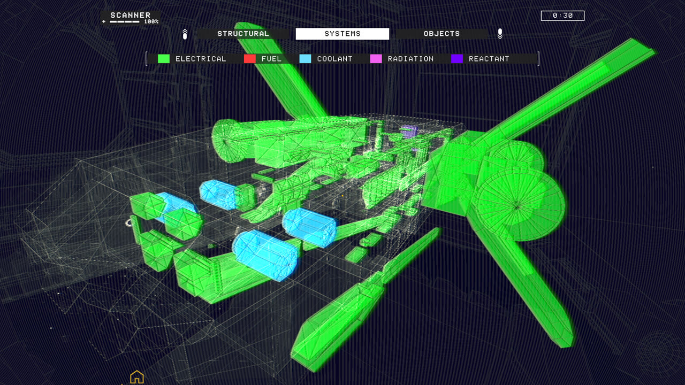

**Esta es la imagen más importante del atlas.** Un escáner sobre un objeto industrial —
literalmente nuestro caso — que resuelve tres cosas que tenemos abiertas:

1. **Pestañas de lente:** `STRUCTURAL · SYSTEMS · OBJECTS`. Un objeto, tres lecturas. Es lo que
   necesita nuestro Foco cuando tenga espesor, expulsores y partición: no tres botones sueltos,
   **tres lentes de lo mismo**.
2. **Leyenda donde el color ES la clave:** eléctrico verde, combustible rojo, refrigerante cian,
   radiación magenta, reactante morado. El color no adorna, se lee.
3. **El resto queda en alambre, no desaparece.** Sigues viendo la nave completa mientras miras
   un sistema. Nuestra pieza debería hacer exactamente eso bajo el Foco.

También trae **un reloj (0:30)**: el escaneo es temporal. Interesante, pero para un CAD lo dejo:
aquí nadie quiere que sus cotas se apaguen solas.

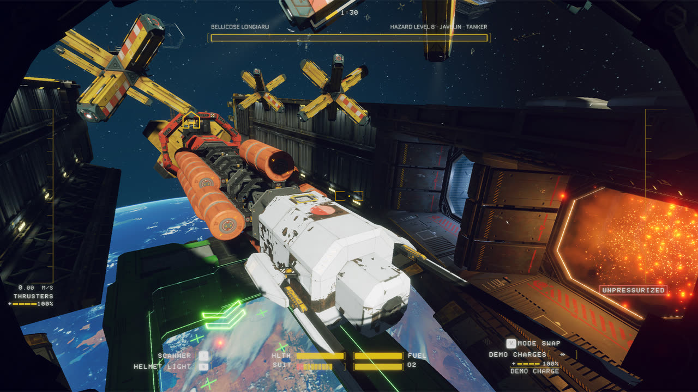

**El HUD del casco.** Todo el instrumental —empuje, salud, traje, combustible, O₂, temperatura
del cortador— vive **abajo y en los bordes**; arriba, el nombre de la nave y su nivel de peligro.
**El centro queda libre para el trabajo.**

**Qué le robo:** las pestañas de lente · el objeto en alambre bajo la capa activa · **el centro
es de la pieza, los datos viven en el borde**.
**Qué le dejo:** el amarillo industrial (precioso, pero en nuestro sistema el cálido ya significa
"esto exige tu atención") y el temporizador.

---

## 1.2 · CYBERPUNK 2077 — *cómo se ordenan veinte campos sin saturar*

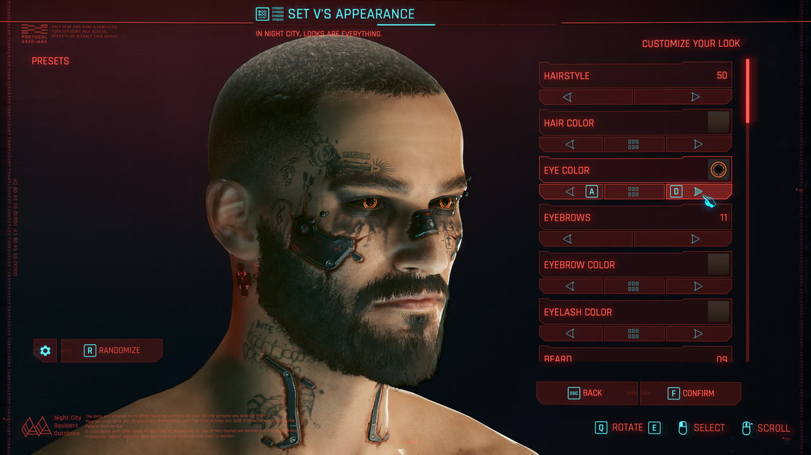

**Qué se ve.** Un panel con ~10 campos que no se siente apretado: etiquetas chiquitas en
versalitas a la izquierda, controles alineados a una columna a la derecha, un solo rojo para lo
activo, fondo casi negro, y **muchísimo aire** entre renglones.

**Qué le robo:** la **disciplina tipográfica** — etiqueta pequeña y apagada, valor claro, todo a
una rejilla. Nuestro dictamen es puro texto y así es como se ordena.
**Qué le dejo:** el rojo como color de sistema (para nosotros el rojo es **violación**) y los
biseles decorativos.

---

## 1.3 · STELLARIS — *la advertencia, no el modelo*

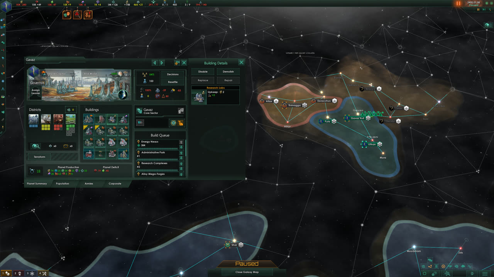

**Qué se ve.** Información densísima repartida en seis paneles simultáneos, cero diégesis, cada
dato con su ventana.

**Está aquí como advertencia.** Es exactamente en lo que se convierte un CAD cuando cada dato
pide su marco — y es lo que ian vio en La Forja y llamó basura. La regla que sale de aquí ya
está en producción: **una ventana sin nada que decir no existe**.

---

## 1.4 · SUBNAUTICA — *el instrumento en la mano*

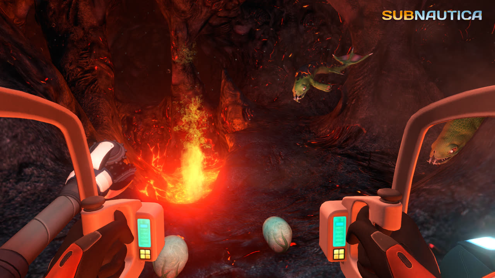

**Qué se ve.** Las herramientas que llevas en las manos traen **su propia pantallita encendida**,
con su color y su barra. No hay HUD flotante: el dato está en el objeto que lo produce.

**Qué le robo:** que el dato viva **en la cosa que lo mide**. Nuestra cota ya lo hace (vive sobre
la arista que mide) y esto lo confirma como principio, no como capricho.

---

# §1.5 · EL HUD DE VERDAD — capturas de partidas, no de marketing

ian: «no hay nada de imágenes del HUD». Tenía razón. Las de la tienda son postales; estas salen
de **capturas de la comunidad de Steam** (partidas reales, HUD encendido). Cuesta encontrarlas
—los jugadores votan lo bonito, no lo informativo— pero estas son de verdad.

### El casco de Shipbreaker: el instrumental en el borde, el centro libre

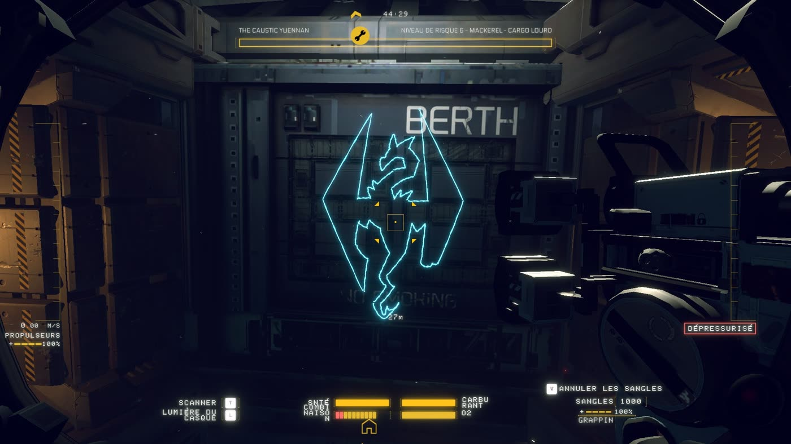
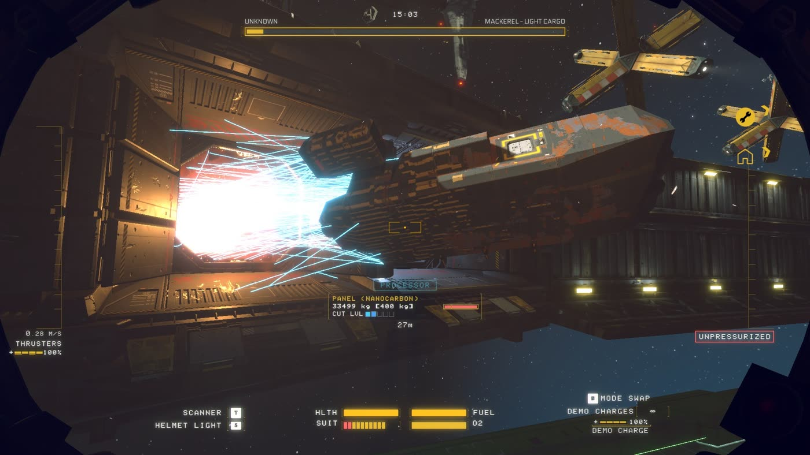

Mira dónde vive todo: **empuje, salud, traje, combustible, O₂ y temperatura del cortador en la
franja de abajo**; arriba, el nombre de la nave y su nivel de peligro; y **el centro entero
libre para trabajar**. Cuando algo urge (`UNPRESSURIZED`) aparece en rojo pegado al objeto que
lo causa, no en una esquina.

**Esto es lo que copio literal.** Nuestro dictamen hoy vive en una columna que se come el 15 %
del ancho; ahí abajo cabría igual y la pieza ganaría todo el cuadro.

### El traje de Prey: la interfaz curvada dentro del casco

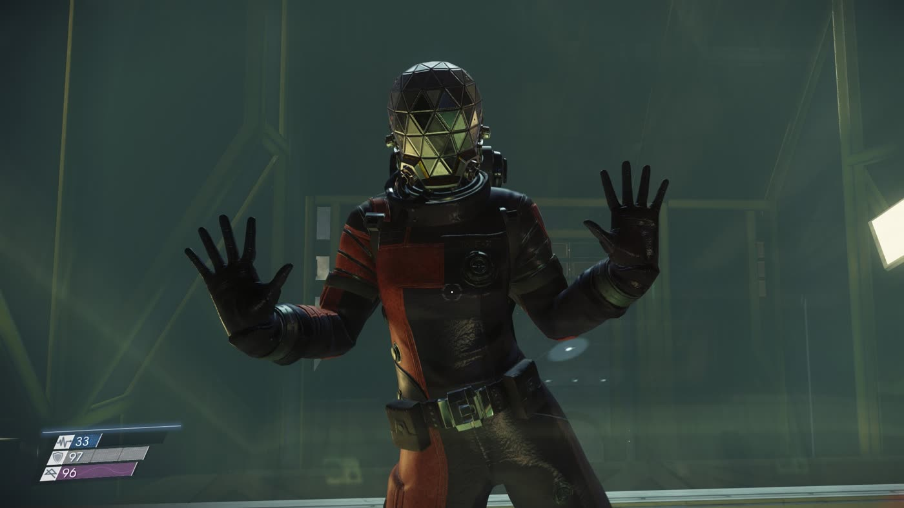
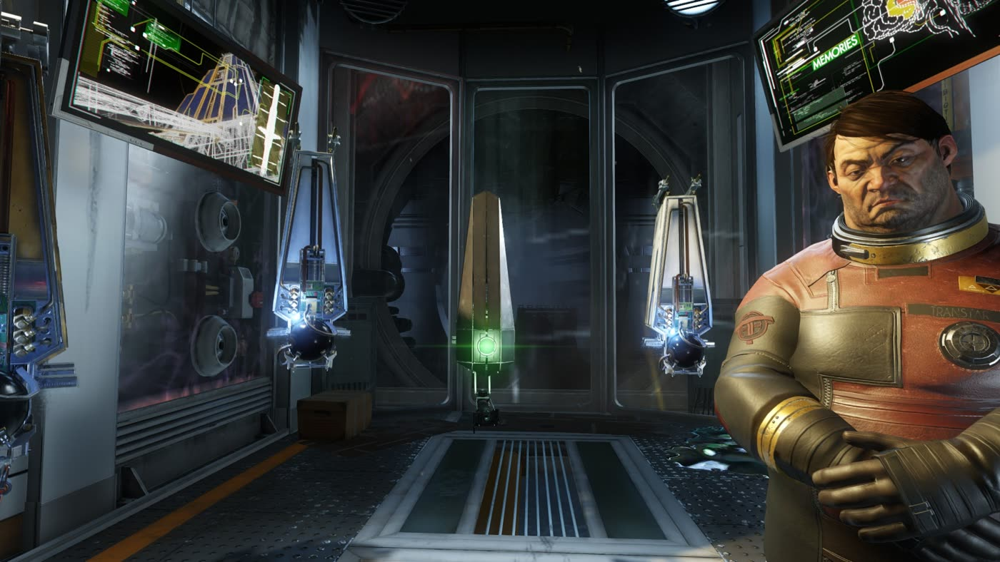

Barras de salud y psi abajo a la izquierda, en cian sobre negro, **con una curvatura sutil**:
se lee como cristal del casco, no como capa pegada al monitor. Ocupa poquísimo.

### Stellaris: cómo se ordena el dato DENSO (y dónde se pasa de la raya)

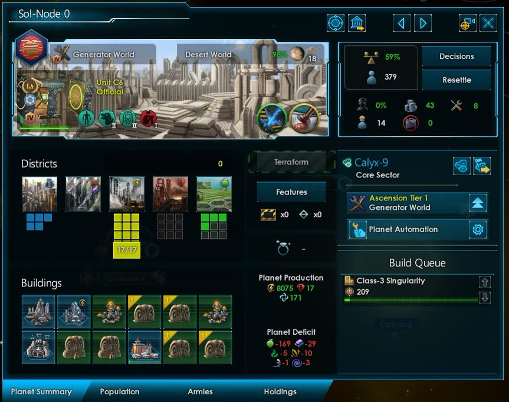
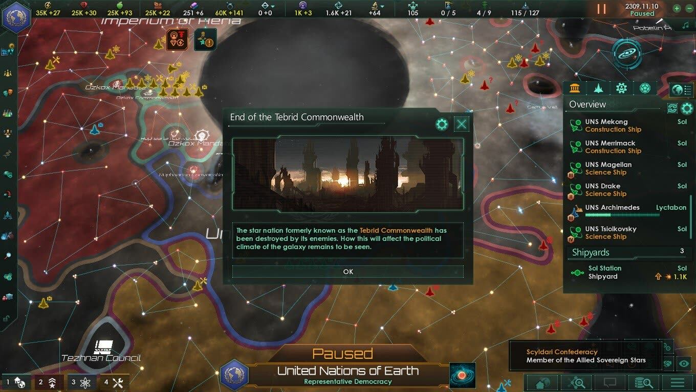

La primera es una **clase de dato denso**: rejillas de iconos por categoría (Districts,
Buildings), la cola a la derecha, los totales abajo, y cada número con su icono para no leer
etiquetas. La segunda es la advertencia: mapa + panel + tooltip + barra superior + barra
inferior, todo a la vez.

**Qué robo:** la rejilla de iconos con su número — nuestro dictamen tiene 69 criterios y así se
verían de un golpe. **Qué dejo:** que todo esté abierto simultáneamente.

### HORIZON: EL FOCO, POR FIN ⭐

Estas **cinco** las capturó **ian** del video [*How Aloy Got Her Focus*](https://www.youtube.com/watch?v=7Akzzktv7Hw)
(min 5:42, 5:59, ~6:20, 8:09 y 8:26) después de que yo no pudiera bajarlas por ninguna vía. Son las
imágenes más importantes del atlas, y **desmienten dos cosas que yo había asumido**.

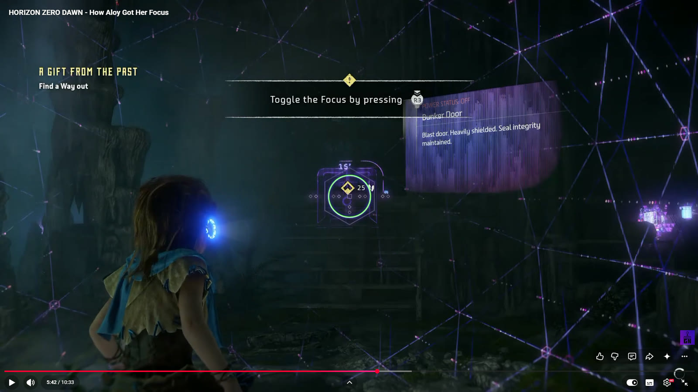

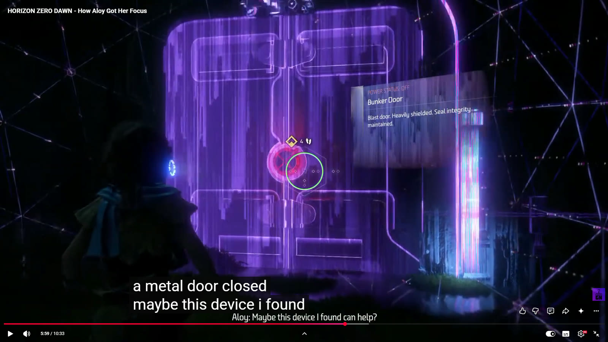

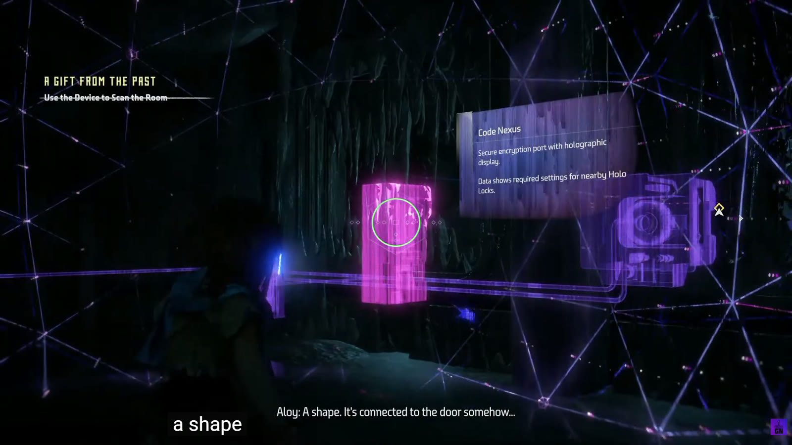

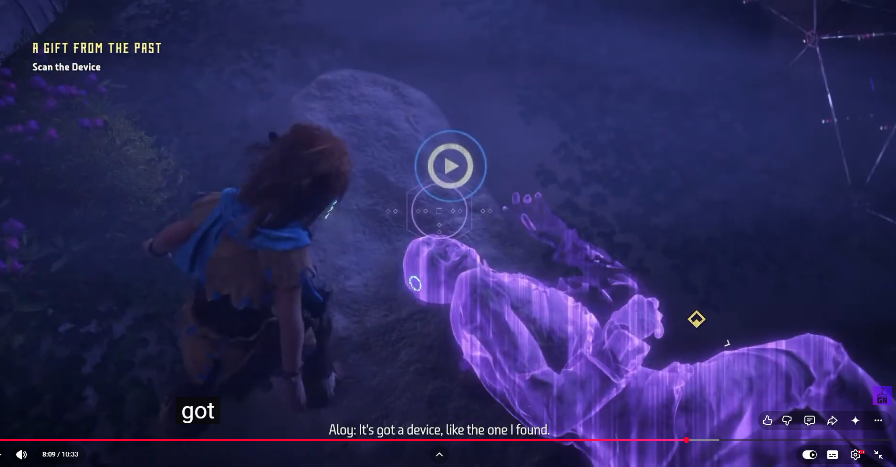

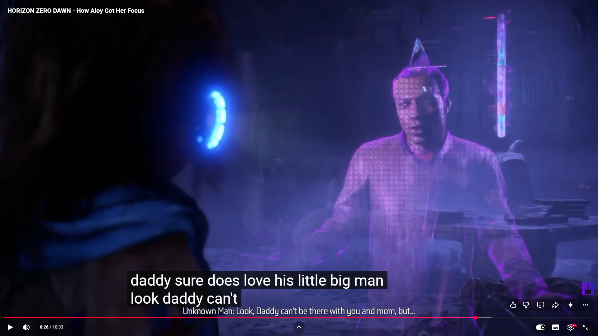

#### Lo que yo tenía MAL

1. **Lo que el Foco proyecta es VIOLETA, no cian.** Yo construí el nuestro entero en cian
   `#5fd4f5`. En Horizon el violeta/magenta se lleva todo lo proyectado y el cian queda de acento.
   No es cuestión de gusto: el violeta es el color que **nadie más usa** en nuestro CAD, así que
   entra como "modo escaneo" sin pelearse con el oro del Banco ni con el rojo de las violaciones.
   *(Ojo: la quinta captura matiza esto y termina de explicarlo — ver «la regla que rescata
   nuestro cian», más abajo. El cian no sobra: tiene otro trabajo.)*
2. **No se transforma la pieza: se transforma EL ESPACIO.** Yo enfrío la pieza a holograma y dejo
   el resto igual. Horizon cubre **todo el cuarto** con una telaraña triangulada de líneas finas.
   Eso es lo que hace sentir "entré a otro modo" — el cambio de idioma completo que hace Titanfall
   al entrar al titán, pero hecho con el ambiente en vez de con un panel.

#### La paleta real, medida en estas capturas

| color | qué significa |
|---|---|
| **violeta / magenta** | la estructura del mundo bajo el escaneo y los objetos analizables (holograma con "lluvia" vertical) |
| **magenta sólido** | el objeto ACTIVO, el que importa ahora (el Nexo de Código) |
| **verde** | el retículo: lo que apuntas en este instante. Es lo ÚNICO verde en pantalla |
| **ámbar** | los marcadores con número (rombo + cuenta) y el texto de misión, arriba a la izquierda |
| **blanco / gris** | la ficha de datos |
| **rojo** | el estado crítico, arriba del título (`POWER STATUS: OFF`) |

#### La anatomía de LA FICHA — lo que más nos sirve

Es la misma en las tres capturas:

- Rectángulo con **borde izquierdo duro**, como una tarjeta que sale de un riel.
- Relleno translúcido con **lluvia vertical** (textura de escaneo, no un degradado bonito).
- **Estado crítico ARRIBA del título**, chiquito y en rojo, solo cuando aplica.
- **Título** grande: `Bunker Door` · `Code Nexus`.
- **Cuerpo en lenguaje natural, no datos crudos**: *"Blast door. Heavily shielded. Seal integrity
  maintained."* — dos frases que cualquiera entiende sin saber del tema.
- **Flota JUNTO al objeto, sin línea de guía.** La cercanía basta.

Eso resuelve T3 mejor que mi plan del "hilo": en vez de una línea cruzando la pantalla, la ficha
se para al lado de lo que describe. Y el **cuerpo en lenguaje natural** es exactamente lo que ian
pidió cuando dijo «no tengo ni idea de qué dice ahí en simulación»: hoy escribimos
`F_eject 5567 N = 108.50 % del cierre`; Horizon escribiría *"Esta pieza necesita más fuerza para
salir del molde de la que tu máquina puede dar."*

#### El retículo verde

Un círculo delgado con cuatro marquitas de diamante: marca **qué estás leyendo ahora**. Nosotros
no tenemos nada así — nuestro Foco enciende todas las cotas a la vez y ninguna es "la que miras".

#### La regla que RESCATA nuestro cian (captura del 8:26)

En la quinta captura pasan las dos cosas al mismo tiempo y por eso vale oro:

- a la izquierda, **el aparato del Foco brilla CIAN** — el arco azul pegado a la sien de Aloy;
- a la derecha, **la persona reconstruida es VIOLETA**.

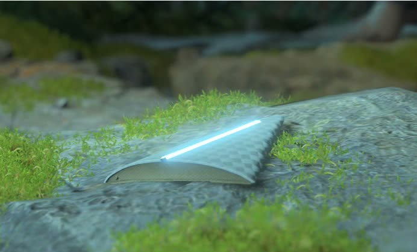

O sea que arriba escribí mal el diagnóstico. No es "el Foco es violeta y yo lo hice cian": es que
**hay dos colores con dos trabajos distintos**, y yo los tenía colapsados en uno:

| | color | qué es |
|---|---|---|
| **el instrumento** | **cian** | la luz del aparato: el retículo, el marco, la cota que él mismo trazó |
| **lo reconstruido** | **violeta** | lo que el aparato *deduce* y te enseña: el registro, la simulación, el cuerpo que ya no está |

Traducido a La Forja, y es una regla que sí podemos cumplir mañana:

- **cian = lo que MEDIMOS.** Las cotas de la envolvente, la pared del ráster, el ⌀ del kernel.
  Existe en la pieza; el Foco solo lo trazó.
- **violeta = lo que SIMULAMOS.** El frente de llenado, el campo térmico, la línea de partición
  propuesta, la fuerza de expulsión. **No existe en la pieza: es un cálculo.**
- **ámbar** sigue siendo *esto exige tu atención* y **rojo** *esto viola el libro*.

Es la separación honesta que llevamos persiguiendo todo el proyecto: el color dice **de dónde
viene el número**. Un ⌀ medido y un frente de llenado calculado hoy se pintan igual, y no lo son.

#### EL ARO — una acción anclada al objeto (captura del 8:09)

Sobre el cuerpo escaneado flota **un aro grueso con un ▶ adentro** y, justo debajo, una placa
hexagonal con una fila de marquitas: `◇ ◇ │ ◇ ◇ ▫ ◇ ◇ │ ◇ ◇`. Eso es un reproductor —
el aro es el botón, la fila es la barra de tiempo del registro. Tres cosas que copiar tal cual:

1. **La acción vive en el mundo, sobre el objeto**, no en una barra de herramientas. Si la pieza
   tiene algo que reproducir (el llenado, la apertura del molde, el ciclo), el botón va **ahí**.
2. **Es grande y es un círculo.** En una pantalla llena de líneas finas, el único elemento gordo
   y redondo se ve desde el otro lado del cuarto. Nuestro `▶ SIMULAR` es hoy un botón de panel
   entre otros doce.
3. **La barra de tiempo son segmentos, no una línea continua.** Cada marquita es un tramo del
   registro. Nuestro ciclo ya viene en etapas (llenar → compactar → enfriar → abrir → expulsar):
   esa fila de marquitas *es* nuestro ciclo.

Y el cuerpo escaneado enseña el detalle del material: la trama no es ruido, **es una retícula
regular de puntos** (se ve clarísimo en la camisa y la cara del 8:26) y **el holograma se deshila
por abajo** en chorros verticales, sin borde duro. Por eso se lee "proyección" y no "objeto de
plástico". Nuestro holograma actual tiene opacidad pareja y borde limpio: parece vidrio, no
reconstrucción. Son dos líneas de shader.

#### Y confirma tu instinto de la tecla

En la primera captura se lee el tutorial: **«Toggle the Focus by pressing R3»**. Un botón
dedicado, no un menú — literalmente lo que pediste. Ya está en producción con la tecla **Q**.

---

# §2 · LAS QUE NO TIENEN CAPTURA DE INTERFAZ

De estos juegos la tienda **no publica una sola captura con el HUD encendido**. Las imágenes
sirven para leer su **arte y su paleta**; la interfaz hay que verla en movimiento (§3).

## 2.1 · HORIZON ZERO DAWN — *el Foco* ⭐ la favorita de ian

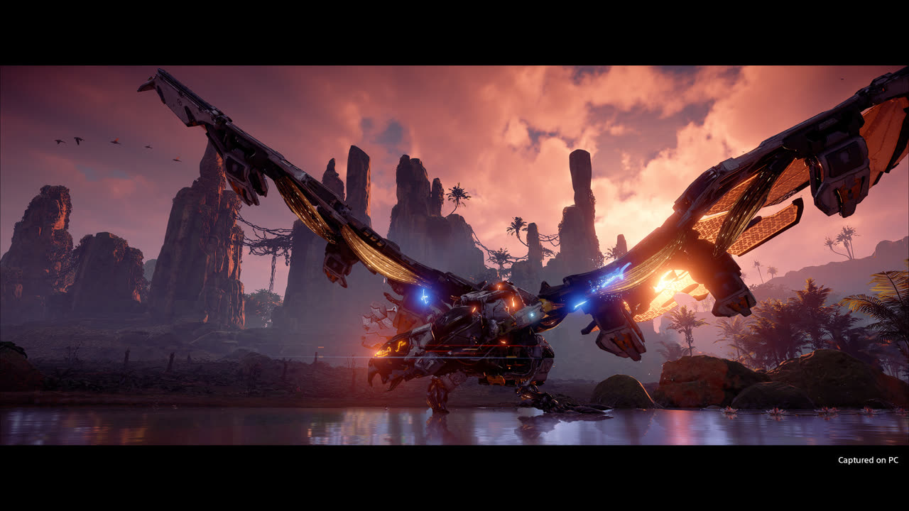
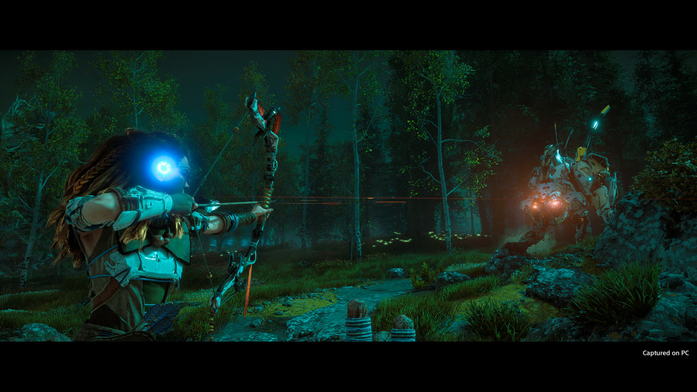

*(Arriba: arte del juego. **El Foco no está encendido en ninguna captura de la tienda** — para
verlo funcionando, el video de §3.)*

**Qué hace su interfaz.** Aloy lleva un aparato de realidad aumentada; al activarlo la máquina
se pinta de azul frío y sus componentes vulnerables saltan en amarillo, y al pasar sobre cada
pieza te dice qué es y por dónde se rompe. La otra interfaz del juego está dibujada como **tiza
y pintura rupestre**: lo holográfico es *lo que la máquina sabe del mundo*, la tiza es *lo que
el jugador necesita*. **No se parecen en nada a propósito** — por eso nunca dudas cuál es cuál.

**Qué le robo:** la separación de idiomas (**EL FOCO** sobre la pieza / **EL BANCO** al costado)
· el color con significado (frío = medido, cálido = atención) · la información **acostada sobre
el objeto**, no al lado. *Ya está en producción.*
**Qué le dejo:** el amarillo saturado en todo; con 30 cotas deja de ser señal.

## 2.2 · DEATH STRANDING — *el odradek*

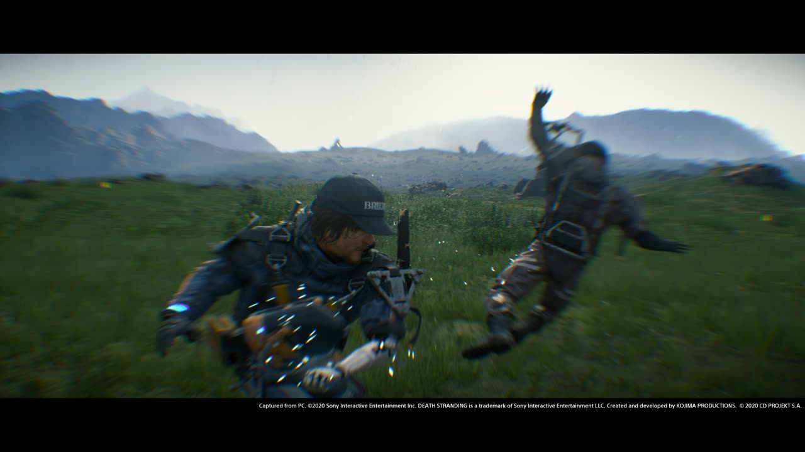

**Qué hace su interfaz.** El escáner es un aparato **físico** en el hombro: se despliega, gira y
marca el terreno. La información aparece porque una máquina la está produciendo, y lo ves.

**Qué le robo:** **EL BARRIDO** — la información no aparece, **se revela**. Es mi apuesta más
barata: una animación de 400 ms sobre lo que ya tenemos.

## 2.3 · ARMORED CORE VI · TITANFALL 2 — *robots, por pedido de ian*

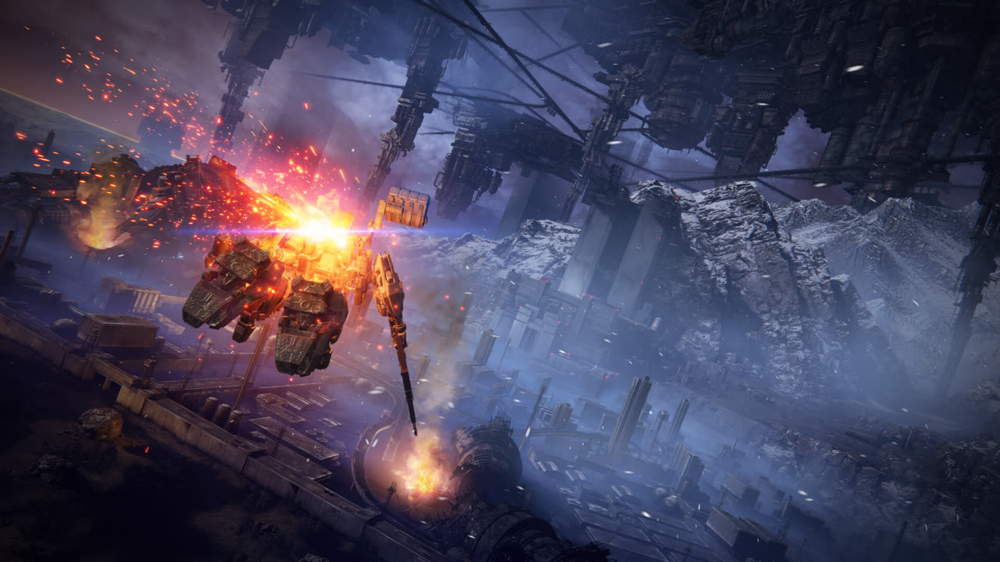
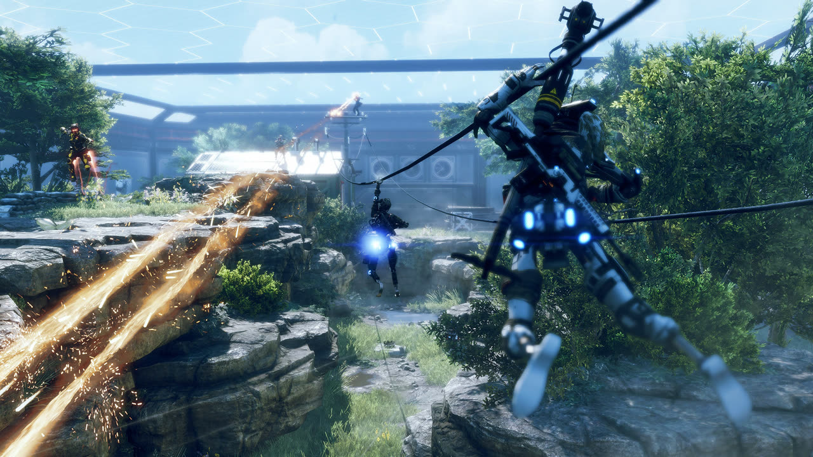

**Qué hacen sus interfaces.** Armored Core: retícula fina, **mucho vacío**, tipografía técnica
diminuta, datos en las esquinas, el centro para el combate. Titanfall: al entrar al titán la
interfaz **cambia de idioma completo** — te habla desde adentro de la máquina.

**Qué les robo:** el **vacío como recurso** (lo contrario de los cuatro paneles vacíos que
teníamos) · y que entrar a un modo **cambie todo el lenguaje visual**, no solo encienda un panel.
Nuestro Foco debe sentirse así de distinto al Banco.
**Qué les dejo:** la tipografía diminuta — una cota tiene que leerse sin acercarse.

## 2.4 · DEUS EX · NIER: AUTOMATA · PREY · GHOSTRUNNER

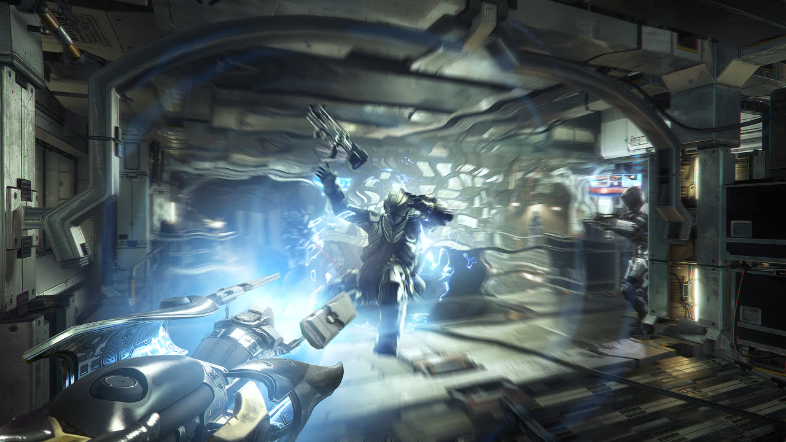
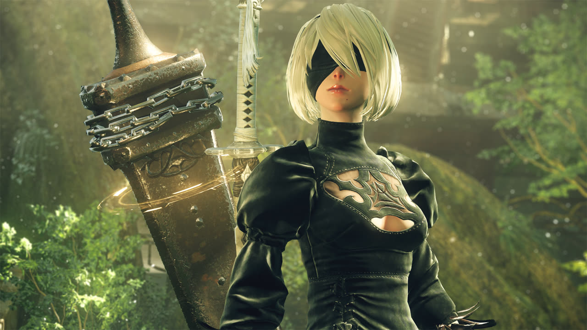
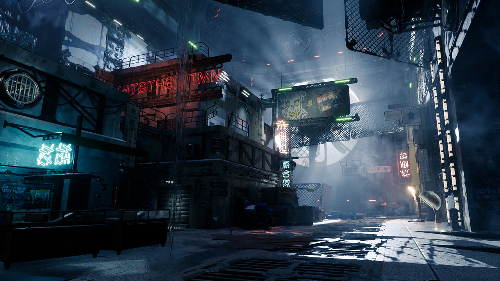

*(Arte y paleta. Ninguna trae interfaz.)*

- **Deus Ex:** negro con oro, la UI se siente implante. Confirma nuestro oro para lo humano.
- **NieR:** una sola tipografía, dos pesos, cero adornos. **Esa disciplina la adopto como regla.**
- **Prey:** la pantalla es un objeto físico dentro del casco (curvatura, reflejo) — con cuentagotas.
- **Ghostrunner:** cian y magenta sobre negro. **Prueba de que dos colores bastan** — el nuestro
  es cian + ámbar y no necesita un tercero.

---

# §3 · LA INTERFAZ EN MOVIMIENTO

Una foto no muestra **el barrido**, que es justo lo que quiero robar.

[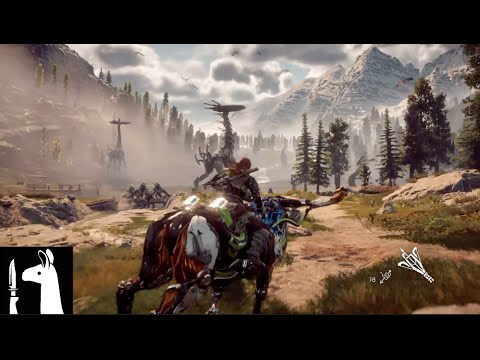](https://www.youtube.com/watch?v=6PBDBRRfE_E)

**Horizon Zero Dawn — E3 2016, análisis del Focus scan** ·
<https://www.youtube.com/watch?v=6PBDBRRfE_E>
Fíjate en **cómo entra** la información: no aparece, barre. Y en que la máquina queda azul con
los puntos débiles en amarillo mientras dura el escaneo.

Búsquedas que no se rompen (los videos cambian de dirección, las búsquedas no):
- Shipbreaker, modo escáner: <https://www.youtube.com/results?search_query=hardspace+shipbreaker+scanner+mode>
- Death Stranding, el odradek: <https://www.youtube.com/results?search_query=death+stranding+odradek+scanner>
- Dead Space, HUD diegético: <https://www.youtube.com/results?search_query=dead+space+diegetic+hud+design>
- Armored Core VI, HUD: <https://www.youtube.com/results?search_query=armored+core+6+hud+gameplay>

Galerías que no dejan descargar pero valen la pena abrir:
- Game UI Database — 1,300 juegos, 55,000 pantallas, filtrable por color y layout: <https://www.gameuidatabase.com/>
- Interface In Game: <https://interfaceingame.com/>

## 3.1 · Cómo VEO yo una animación — el protocolo (tu «MALDICIOOOON»)

Preguntaste bien: *«estas son animaciones pero no sé cómo puedes ver animaciones así»*. La
respuesta honesta: **no puedo ver video.** No hay reproductor de mi lado, y bajarlo tampoco
sirve — el archivo es un binario que yo no reproduzco. Pero el problema es de **muestreo**, no
de ceguera, y ya lo resolviste tú sin saberlo:

**Tú ya usaste el método correcto.** Me mandaste 5:42, 5:59, 6:20, 8:09 y 8:26. Cinco fotos del
mismo efecto en momentos distintos **son** la animación: de comparar el 5:42 con el 5:59 leo que
el relleno del holograma corre de arriba hacia abajo; del 8:09 al 8:26 leo que la trama es una
retícula fija en pantalla y no viaja con el objeto. Eso es exactamente lo que necesito para
escribirlo en shader.

Las tres formas que sí funcionan, de mejor a peor:

1. **2 o 3 fotos del MISMO efecto separadas por medio segundo.** Con eso leo la *diferencia*, que
   es lo único que define una animación: qué se mueve, hacia dónde y con qué curva. Barato y es
   lo que ya hiciste.
2. **Descríbemela en una frase y yo la construyo, tú la juzgas.** «El barrido tarda como medio
   segundo y va de abajo hacia arriba» me basta para hacerla; luego te mando el video y la
   corriges. Es el ciclo normal de La Forja: yo mido, tú ves.
3. **Un video que YO genero, no que consumo.** De un archivo local sí puedo sacar cuadros con
   `ffmpeg` cada *n* segundos y leerlos uno por uno. Sirve para revisar **nuestros** renders (y
   así reviso los 4K); no sirvió aquí porque YouTube ya no deja bajar (pide *PO tokens*).

**La regla que queda para el proyecto:** cuando una referencia sea movimiento, no me mandes el
enlace — **mándame dos cuadros del momento que te gustó.** Con dos cuadros la reconstruyo; con
un enlace me quedo con la descripción de alguien más.

---

# §4 · LA DECISIÓN — qué toma La Forja

En orden de cuánto cambia el producto:

| # | de dónde | qué |
|---|---|---|
| 1 | **Shipbreaker** | **Pestañas de lente** sobre la misma pieza (espesor · expulsores · partición), leyenda de color, y el resto en alambre |
| 2 | **Death Stranding / Horizon** | **EL BARRIDO**: la información se revela, no aparece |
| 3 | **Shipbreaker / Armored Core** | **El centro es de la pieza**; los datos viven en el borde |
| 4 | **Horizon** | Dos idiomas que no se parecen: Foco frío sobre la pieza, Banco sólido al costado |
| 5 | **Cyberpunk / NieR** | Una tipografía, dos pesos, todo a una rejilla; etiqueta apagada, valor claro |
| 6 | **Ghostrunner** | Dos colores bastan: cian = medido, ámbar = atención |
| 7 | **Horizon (8:26)** | **El color dice de dónde viene el número**: cian = medido · violeta = simulado |
| 8 | **Horizon (8:09)** | **EL ARO**: el botón de reproducir anclado sobre la pieza, con el ciclo en marquitas |
| 9 | **Horizon (8:09/8:26)** | El holograma con **trama de puntos** y **deshilado abajo** — proyección, no vidrio |
| — | **Stellaris** | La advertencia: un dato ≠ una ventana |

Lo que **no** tomamos: ángulos cortados (Deus Ex) y corchetes de visor (Detroit) — envejecen
rápido y le pelean legibilidad a una tabla de números; amarillo industrial (Shipbreaker) — el
cálido ya está reservado para lo que exige atención.

---

## Cómo se armó este atlas (para poder repetirlo)

`scripts/bajar-referencias-hud.py` pide a la API pública de Steam el nombre y los screenshots de
cada juego, los baja del CDN oficial, los reduce a 1280 px y deja `manifiesto.json` con la
atribución. **52 imágenes, 12 juegos, 8.5 MB.** Repetirlo con más juegos es agregar un renglón.

*Las imágenes son material de referencia de diseño, propiedad de sus estudios: Guerrilla Games,
Blackbird Interactive, Kojima Productions, CD Projekt Red, Eidos-Montréal, Respawn,
FromSoftware, PlatinumGames, Unknown Worlds, Arkane, One More Level y Paradox. Miniatura de
video: YouTube.*
